Read this in other languages.

[Thai](README.th.md)

# Hacktoberfest EZ

Easy ideas to start contributing on Github, get [free T-Shirts](http://hacktoberfest.digitalocean.com/) every year!

## PR Ideas

- Add ideas to this repo! 😂
- Fix code formatting.
- Fix typos. (Try searching `funcation` in Github...)
- Translate project readme.md to local language.
- Fix issue in open source project.
- Explore codetriage.com.
- Add [mini-game](https://github.com/chunza2542/noobtoberfest).

## No ideas?

Try contributing to this repo itself. (So meta...)

- Fix typos if you see them. 👀
- Add frontend.
- Add more README.
- Add tests, cli, Docker image which prints PR ideas.
- Add to this list.

## Contributing

- Append the `PR Ideas` list, then open the Pull Request.
- Or see [issues](https://github.com/narze/hacktoberfest_ez/issues) for more easy peasy tasks. Some of these issues are added from [PDD Puzzles](http://www.0pdd.com/).

### Steps to open a Pull Request

<!-- @todo #1 We need to describe these steps with more detail to it. -->

Fork >> Clone >> NewBranch >> Edit >> Commit >> Push >> PullRequest

### Fork

1. Click **Fork** button.
   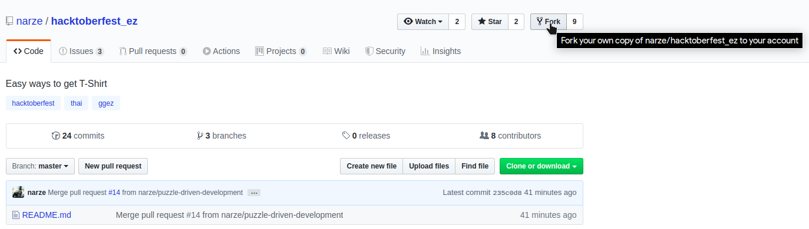
2. Wait until it is done.
   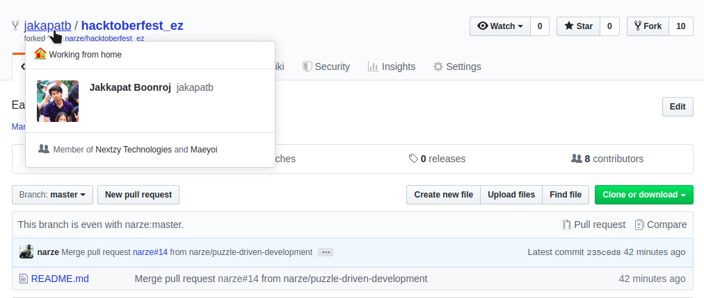

### Clone

1. Copy the **HTTPS** repo link.
   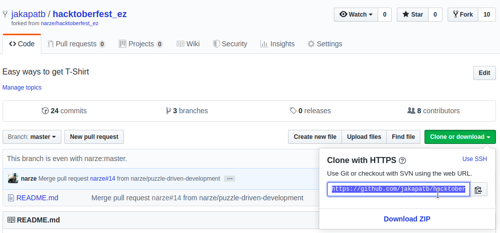
2. Open a terminal and write a command `git clone [your repo link]`.
   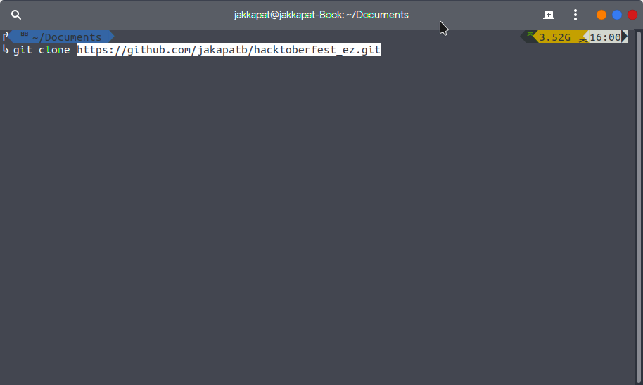
3. Go to hacktoberfest_ez/ folder.
   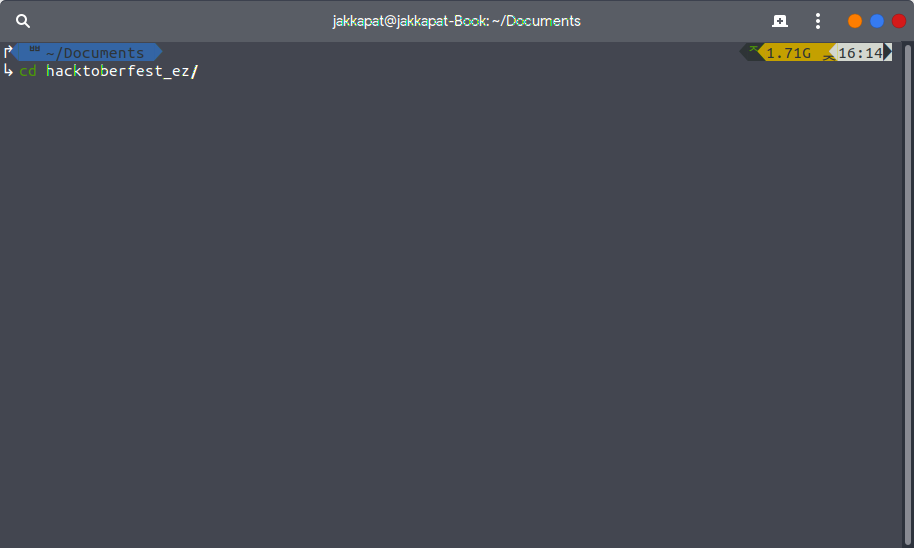

### New Branch

1. Create new branch using `git branch [branch name]`.
   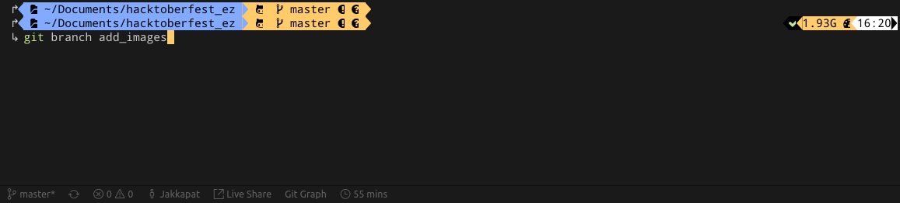
2. Go to that branch using `git checkout [branch name]`.
   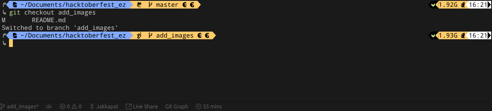

### Commit

#### via VS Code

1.  Click stage all change & write commit message.
    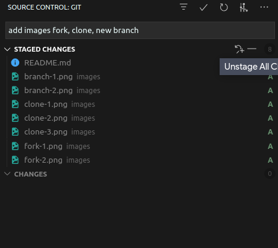
2.  Click Commit button.
    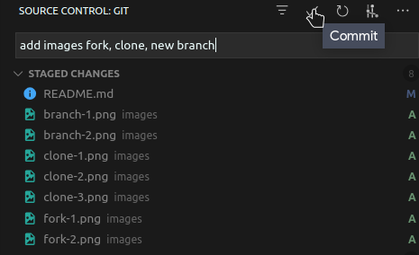

#### via terminal
1. Open a terminal and write a command `git add .`
2. write a command `git commit -m [your commit message]`.

### Push

1. Click Sync button (bottom of vscode).
   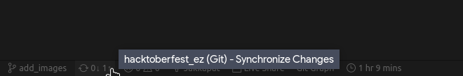

### Pull Request

1. Refresh your hacktoberfest_ez in the browser, then click "Compare & pull Request".
   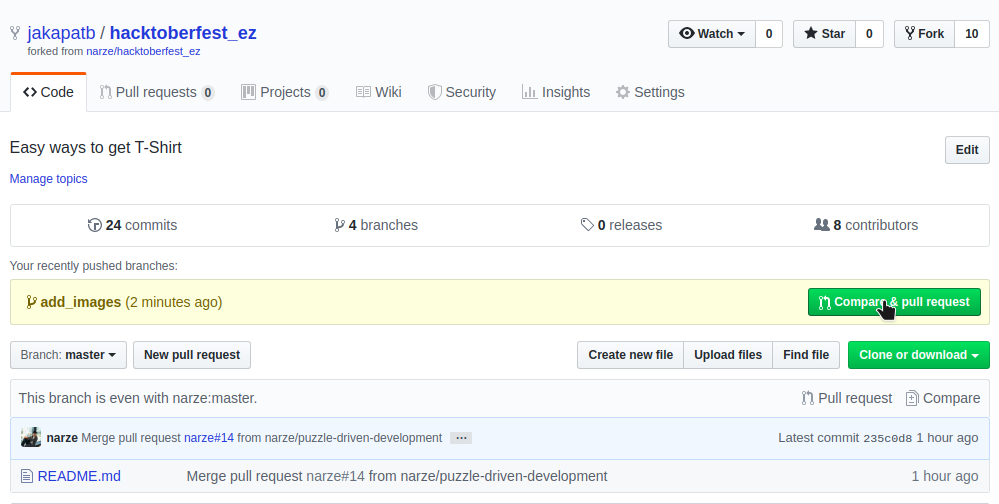

2. Write description pull request, then click "Create pull request".
   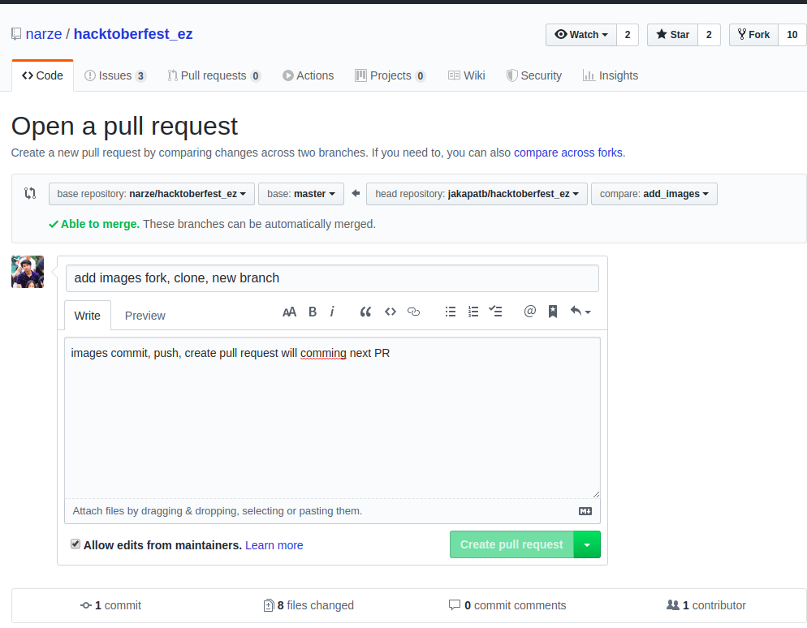
3. Done!
   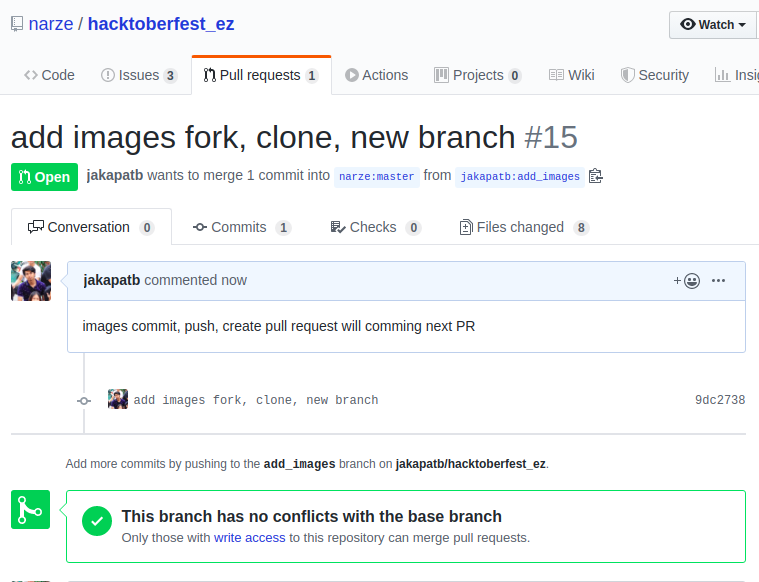

## Learning

Go to github.com and make an account and see tutorials on:

- how to fork the project
- how to create a repository
- how to clone the repository
- how to make a pull request

and make your contribution towards Open Source community in Hacktoberfest.
